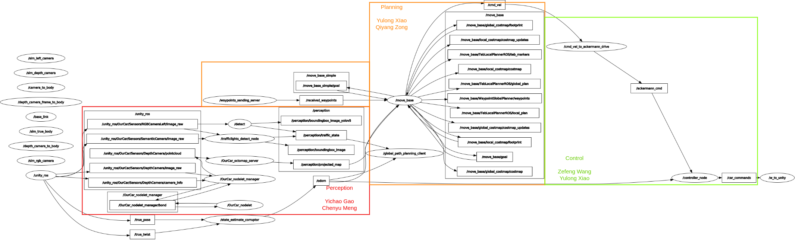
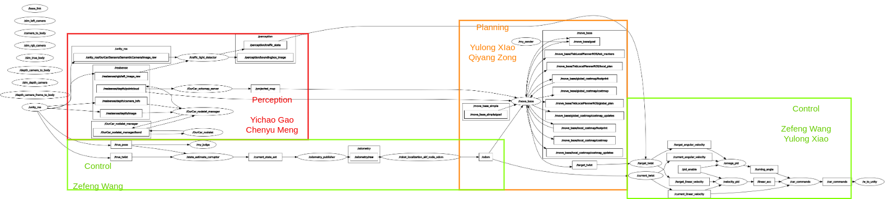
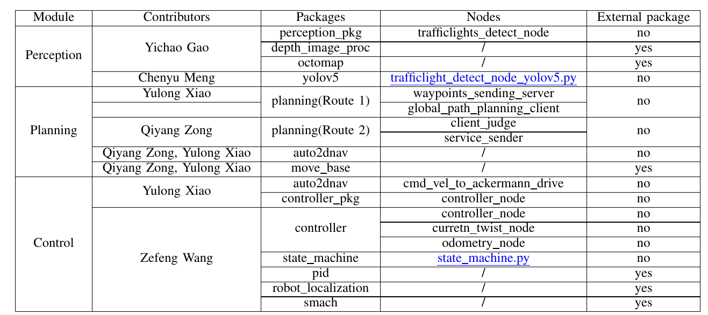

# Result Presentation

Video: [Route 1](https://drive.google.com/file/d/1q7wo_83JWUoRK_NPq6S9dEWp2XwJMmIj/view?usp=drive_link)
[Route_1_acc.wmv](/uploads/8c18a7bc78ccc100144c4592ae8106f6/Route_1_acc.wmv)

<figure class="video_container">
  <iframe src="https://drive.google.com/file/d/1q7wo_83JWUoRK_NPq6S9dEWp2XwJMmIj/preview" frameborder="0" allowfullscreen="true"> </iframe>
</figure>

Video: [Route 2](https://drive.google.com/file/d/13j84ydKm6jeO1DN4xlv6FYHlcqDo4qkU/view?usp=drive_link)

<figure class="video_container">
  <iframe src="https://drive.google.com/file/d/13j84ydKm6jeO1DN4xlv6FYHlcqDo4qkU/preview" frameborder="0" allowfullscreen="true"> </iframe>
</figure>

|                 | global planner | local planner | controller |
| --------------- | --------------- | --------------- | --------------- |
|    Route 1  | [waypoint-global-planner](https://github.com/gkouros/waypoint-global-planner)  |   [teb_local_planner](http://wiki.ros.org/teb_local_planner)   | Ackermann controller |
|   Route 2  | [move_base](http://wiki.ros.org/move_base) build-in global_planner   | [move_base](http://wiki.ros.org/move_base) build-in base_local_planner| PID controller |

## Rosgraph
- Route1


- Route2


## Tasks
- [x] Successfully working perception pipeline 
- [x] Successfully working path planning
- [x] Successfully working trajectory planning 
- [x] Successfully avoiding other cars
- [x] Successfully stopping/driving at street lights 
- [x] Time to complete the mission: 212s
- [x] Solving the problem without using semantic camera: YOLOv5
- [x] New msg: perception_msgs/Boundingboxes.msg, perception_msgs/Boundingbox.msg, perception_msgs/Trafficstate.msg
- [x] New Service: planning/srv/PlanGoal.srv


# Prerequisites
> Please git clone this repo according to the first step in **Getting Started**

- Run the sh file to install all packages

```shell
chmod +x requirements.sh
./requirements.sh
```

- Or Run following command to install required packages.

Perception:
```shell
sudo apt install ros-noetic-octomap-rviz-plugins ros-noetic-octomap-server
pip install -r Autonomous_Driving_ws/src/perception/yolov5/src/yolov5/requirements.txt
```

Control:
```shell
sudo apt install ros-noetic-pid ros-noetic-robot-localization ros-noetic-smach-ros
```

Planning
```shell
sudo apt-get install ros-noetic-navigation
sudo apt-get install ros-noetic-teb-local-planner
sudo apt-get install ros-noetic-ackermann-msgs
```

# Getting Started

1. Use the following command to clone the repository
```shell
git clone git@gitlab.lrz.de:i2ros_g13/i2ros_g13_autonomous_driving.git --depth 1

```
2. Build it with `catkin build`.
3. Download the Unity Environment: https://syncandshare.lrz.de/getlink/fiEg9ocZ6Pc5iuEa4QqN1b/
4. Unzip the Unity file and copy the files to .../devel/lib/simulation/
5. run the following command to launch.
```shell
source devel/setup.bash
roslaunch simulation yolov5_simulation.launch 
```

  
The car will start driving along the generated global and local path.
The traffic rules will be followed correctly.

# Modules description


## Perception
- perception_pkg: including a node ```trafficlights_detect_node```, which extract the area of traffic light from semantic image and then recognize the color of the traffic light in RGB image. It gives the controller the state of traffic light to stop the car of let it move again. Additionally a bounding box in color red or green is also drawn and outputed by this node.
- depth_image_proc: a package to convert the depth image data to 3D point cloud data.
- OctoMap: a package which can get the occupancy grids and map from 3D point cloud data.
